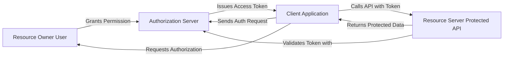
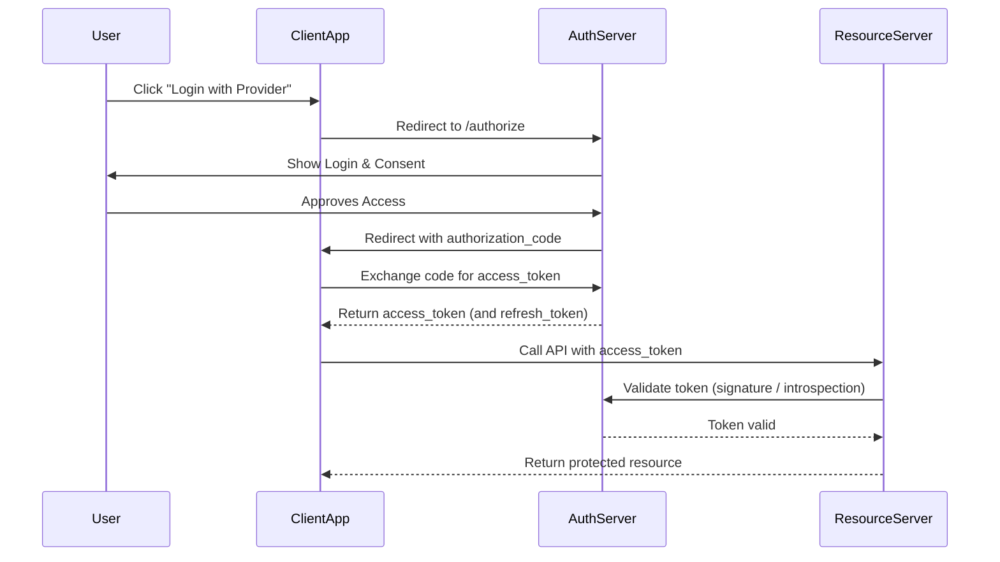

# Oauth2.0

## 💬 10️⃣ Summary

| Concept                  | Meaning                                        |
| ------------------------ | ---------------------------------------------- |
| **OAuth 2.0**            | Standard for authorization using access tokens |
| **JWT**                  | Format for carrying access token info          |
| **Authorization Server** | Issues tokens                                  |
| **Resource Server**      | Validates tokens before serving data           |
| **Client**               | Requests tokens, calls APIs                    |
| **Scopes**               | Define what actions are allowed                |
| **Grant Type**           | Defines how token is obtained                  |

## 🪜 Your Learning Path (Recommended)

| Step | Topic                                  | Practice                           |
| ---- | -------------------------------------- | ---------------------------------- |
| 1️⃣  | Understand OAuth 2.0 basics (today ✅)  | Draw architecture                  |
| 2️⃣  | Learn JWT structure                    | Decode at [jwt.io](https://jwt.io) |
| 3️⃣  | Run a local **Keycloak** server        | Create realm + client              |
| 4️⃣  | Secure a Spring Boot REST API          | Validate JWT                       |
| 5️⃣  | Secure Spring Cloud Gateway            | Forward tokens                     |
| 6️⃣  | Add scopes/roles authorization         | Enforce access rules               |
| 7️⃣  | Use Postman or Angular to authenticate | End-to-end test                    |

## 🔍 Explanation
- The client never gets the user’s password — only an access token.

- The resource server trusts the authorization server for validation.

- Tokens represent delegated access, not credentials.

## 🔄 2️⃣ OAuth 2.0 Authorization Code Flow (most common)

